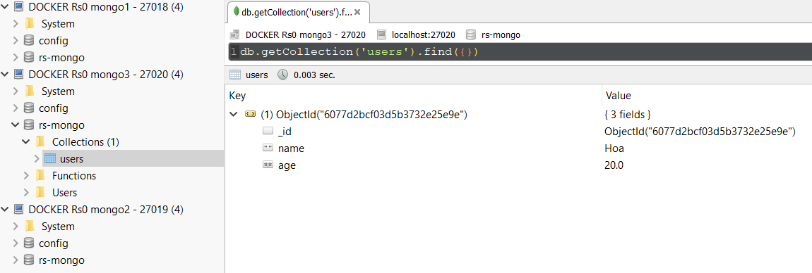

# Start MongoDB using Docker in Replicaset mode
Warning: use version `MongoDB 4.2 or earlier` to avoid conflicts when starting up on the existing data files

Errors if starting with MongoDB version > 4.2 on the existing database

```
MongoDB is too recent to start up on the existing data files. Try MongoDB 4.2 or earlier.
```

- Step 1: start the mongo databases

```docker-compose -f mongo-replicaset.yml up```

- Step 2: exec into one of the mongos:

```docker exec -it mongo1 /bin/bash```

- Step 3: access mongo console

```mongo```

Check the current collections are there in the database, using ```db.getCollectionNames()```

Error get in case `NOT` configured the `replica set` mode
```
2021-04-15T04:40:27.578+0000 E  QUERY    [js] uncaught exception: Error: listCollections failed: {
        "ok" : 0,
        "errmsg" : "not master and slaveOk=false",
        "code" : 13435,
        "codeName" : "NotPrimaryNoSecondaryOk"
} :
_getErrorWithCode@src/mongo/shell/utils.js:25:13
DB.prototype._getCollectionInfosCommand@src/mongo/shell/db.js:835:15
DB.prototype._getCollectionNamesInternal@src/mongo/shell/db.js:907:12
DB.prototype.getCollectionNames@src/mongo/shell/db.js:916:12
@(shell):1:1
```

- Step 4: configure replica set by pasting the following

```
rs.initiate(
  {
    _id : 'rs0',
    members: [
      { _id : 0, host : "mongo1:27018" },
      { _id : 1, host : "mongo2:27018" },
      { _id : 2, host : "mongo3:27018" }
    ]
  }
);
```

We will get the results

```
{ "ok" : 1 }
rs0:PRIMARY> db.getCollectionNames();
[ ]
rs0:PRIMARY>
```
Attempt to create a collection `rs-mongo.users` on PRIMARY node

```
rs0:PRIMARY> use rs-mongo;
rs0:PRIMARY> db.users.insert({name: "Hoa", age: 20});
WriteResult({ "nInserted" : 1 })
rs0:PRIMARY> db.getCollectionNames();
[ "users" ]
rs0:PRIMARY>
```

Completed! We have installed the MongoDB running on Replicaset mode

# Access MongoDB from Host


